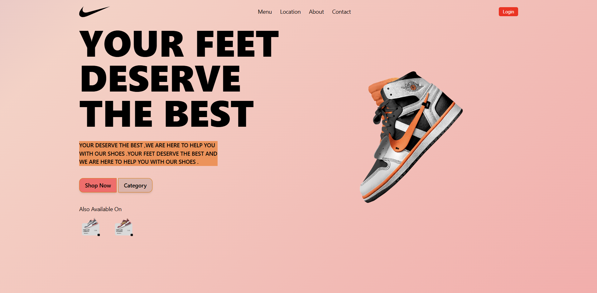

# Your Feet

A modern, responsive e-commerce web application built with **React** and **Tailwind CSS**. "Your Feet" is designed to showcase and sell sneakers with a visually appealing interface and smooth user experience.

## Features

* Fully responsive design for mobile, tablet, and desktop screens.
* Eye-catching product display with hover animations.
* Tailwind CSS for easy styling and customization.
* React components for modular and reusable code structure.
* Easy navigation with menu links and action buttons.

## Project Preview


## Tech Stack

* **React** – Frontend library for building UI.
* **Tailwind CSS** – Utility-first CSS framework for styling.
* **JavaScript / JSX** – Logic and component structure.
* **Vite** – Fast development server and build tool.

## Installation

1. Clone the repository:

```bash
git clone https://github.com/zebaameen/your-feet.git
```

2. Navigate to the project folder:

```bash
cd your-feet
```

3. Install dependencies:

```bash
npm install
```

4. Start the development server:

```bash
npm run dev
```

5. Open your browser at the displayed URL to see the project in action.


